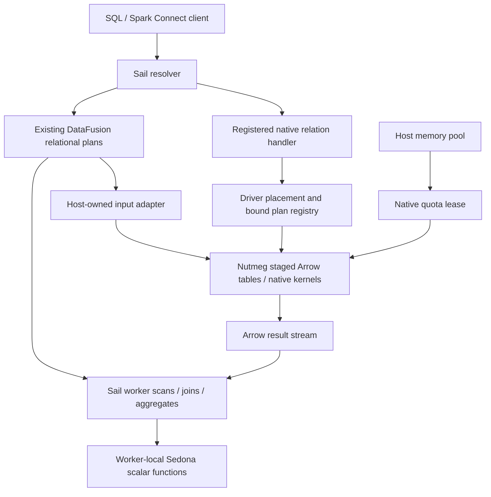

# Sail extensions: implementation and maintainer review

## Recommendation

Adopt a small, experimental host contract for trusted native extensions, in
separate reviewable changes. Keep spatial and graph implementations outside Sail
engine crates. Use Sail's existing DataFusion execution for relational graph
queries; require explicit staging when a user chooses native graph kernels.

The proof of concept demonstrates this separation with Apache SedonaDB scalar
functions and Nutmeg graph operations. It also establishes that loading a native
function is only part of the contract: distributed identity, field metadata,
resource ownership, placement, retries and teardown must remain correct.

**Do not propose the entire branch as one upstream PR.** The branch is a working
integration and evidence collection, not the intended size of the permanent API.
The defensible upstream request is the set of host capabilities below, each with
an independently reviewable invariant and a concrete consumer. No graph-specific
operator or Sedona dependency needs to enter Sail's core.

## Review boundary and provenance

This review describes implementation commit
[`de8e670989edb8ed5343764c52d0d002b6b6cd63`](https://github.com/querygraph/sail/commit/de8e670989edb8ed5343764c52d0d002b6b6cd63)
on `querygraph/sail`, branch `work/extensions-datafusion-graphs`, relative to
upstream baseline `a85d912d72ae03a6d97b6a3fd151f5752da636c6`.
Documentation added after that commit does not extend its executable gate verdict
to a new source revision. This is a source and evidence review, not a fresh test
run or an assertion that the API is production-ready.

The baseline-to-implementation diff is 148 files, 30,210 inserted lines and
197 deleted lines. Counts include tests, vendored source and lockfiles:

| Area | Files | Insertions | Deletions |
| --- | ---: | ---: | ---: |
| Host crates | 68 | 4,865 | 115 |
| Example extensions, clients, vendor and harness | 73 | 24,079 | 0 |
| Development documentation | 5 | 1,092 | 0 |
| Root build files | 2 | 174 | 82 |

These numbers describe the delivered branch, not an estimated upstream patch.
Extraction and narrowing are proposed work; they have not already been done.
The [implementation plan](implementation-plan.md),
[original review](implementation-review.md),
[correction record](implementation-review-resolution.md) and
[graph follow-up plan](datafusion-graph-plan.md) preserve the design's evolution.

## What was built

| Surface | Delivered behavior | Boundary |
| --- | --- | --- |
| Native package bootstrap | Opt-in Python entry points load separately built native wheels; manifests, names, aliases and relation URLs are checked | Trusted installed code; experimental exact-build compatibility |
| SedonaDB | 128 exported native/GEOS scalar functions plus aliases; SQL and Connect expression composition | Registration count is not exhaustive semantic qualification of every function |
| Distributed scalar execution | Worker loading, package identity checks and expression serialization | Required package must already be deployed on every worker |
| Geometry composition | Compatible WKB field metadata survives selected expressions, arrays and shuffles | Not universal propagation for every expression or client geometry UDT |
| Nutmeg graph tables | Degree, triplet and bounded-walk helpers produce ordinary relational plans | No native extension, CSR or new engine operator required |
| Native graph relations | Explicit stage, algorithm, scan, status and drop operations through Connect relation extensions | Graph state and native kernels remain driver-resident |
| Native memory | Host-funded quota, admission before expansion, shared CSR cache and retained-output ownership | Non-spillable, coarse reservation; not a process RSS ceiling |
| Lifecycle | Interrupt, early consumer termination, session deletion/expiry and graceful shutdown coverage | Synchronous initial CSR construction and final staging sort are not preemptible |
| Deployment | Repaired GEOS wheels, macOS/Linux gates and a real two-host functional run | No general Kubernetes or arbitrary mixed-architecture qualification |

The independent extension workspaces live under
[`examples/extensions`](../../../examples/extensions/README.md).
Sedona source is pinned at `0a1993d9be8bcf52150593ad08fc6a3412d50f29`;
Nutmeg/Grust vendor provenance is pinned at
`f267b03659dd536981f98420944f911b667632b7`.
Host and wheels use DataFusion 55.1.0, Arrow 59.3.0 and PyO3 0.29.0.
Sedona has no Sail crate dependency. Nutmeg shares only the dependency-free
resource-lease ABI crate, not a Sail engine crate.

### Execution architecture



There is no second DataFusion engine or out-of-process Nutmeg service in this
architecture. CSR is an adjacency representation built for native algorithms.
An ordinary relational graph query stays in Sail's existing optimizer and
scheduler. A native region is opaque to the host optimizer; visible input and
output relations still compose with normal Sail operators.

### Sedona: reuse native functions without importing a spatial engine

The extension imports actual SedonaDB Rust/GEOS scalar functions through
DataFusion FFI. Representative construction, text conversion, predicates,
distance, area, null handling, aliases and composition are tested. Ordinary Sail
joins can evaluate spatial predicates. No indexed `SpatialJoinExec`, spatial
optimizer rule, raster surface or complete Spark Sedona implementation was built.

Five colliding names are deliberately excluded: `st_asbinary`, `st_geomfromwkb`,
`st_geogfromwkb`, `st_setsrid`, and `st_srid`. Sail retains its first three
implementations and the latter two existing placeholders. The extension does not
make those placeholders functional or replace builtin semantics silently.

Geometry uses GeoArrow WKB field metadata. The correction preserves compatible
fields through native/builtin nesting, CASE, coalesce, array construction and
indexing, including distributed serialization. Incompatible ordinary binary,
geography and CRS combinations are rejected. This is a typed-field correctness
requirement; copying arbitrary metadata from an arbitrary child would be wrong.

The pinned Sedona source needed a DataFusion 54/Arrow 58 to 55/59 compatibility
port. Only the scalar-required surface was qualified. Wheels bundle GEOS and
have their native dependency closure audited; macOS minimum-version tags reflect
the actual bundled dependencies. This is not a claim of universal wheel portability.

### Nutmeg: relational first, native kernels by explicit choice

```python
from sail_nutmeg import Nutmeg

nm = Nutmeg(spark)
g = nm.tables("nodes", "edges").validate()
g.degrees().show()          # ordinary Sail joins and aggregates
ng = g.walks(2)             # bounded walks, preserving edge multiplicity
ng.show()
nm.stage("snapshot", g.nodes, g.edges)  # explicit native capture
nm.nodes("snapshot").show()           # staged Arrow scan, no CSR
nm.run("snapshot", "pagerank").show() # explicit driver-native algorithm
nm.drop("snapshot")
```

The [GraphTables helper](../../../examples/extensions/nutmeg/python/sail_nutmeg/graph.py)
accepts table names or DataFrames. It preserves ordinary ID/property types and
normal execution-time table consistency. Validation checks unique non-null nodes
and valid endpoints. Degree results include isolates; duplicate edges and loops
retain their multiplicity. Walks may revisit vertices and edges: closed walks are
not counts of deduplicated triangles or simple cycles. This path works with
native extensions disabled and needs no Sail graph-specific change.

Staging consumes all input partitions, including empty partitions. Normalization
uses UTF8 identifiers and `property.*`/`present.*` fields; staged scans are not a
lossless round trip of every original table type. Explicit nodes define the node
set. Failed staging leaves the previously published graph intact. The Python
stage/drop helpers consume receipts eagerly; provider planning itself does not
publish or delete state.

Each native reader pins a published entry. Overwrite/drop does not invalidate
existing readers. Independent algorithm readers share a synchronized CSR cache
per entry and projection options. Displayed revision numbers restart after
recreation, so cache identity is not just graph name plus revision number.
Separately resolved node and edge scans do not promise one common revision
across concurrent replacement; the Rust snapshot API can pin both together.
There is no automatic CSR eviction or dynamic quota lending.

Native results can feed downstream distributed SQL. This does **not** distribute
the native CSR kernel itself. Distributed iterative graph algorithms need a
separate design for partitioned state, round exchanges, convergence, deterministic
reductions and recovery. That work must not be implied by the distributed SQL tests.

## Necessary host contracts and their justification

### 1. A bounded relation entry point

The Connect envelope carries a payload type URL, opaque payload and ordinary
Connect input plans. Sail validates version, size, arity and registration before
planning children. Input expressions are currently rejected explicitly. Limits
are 8 MiB per envelope, 1 MiB payload, 16 inputs, 512-byte type URLs and nesting
depth 64. Registered input-free handlers may opt into a bare Any payload.

The host must own parsing and dispatch because it owns the Connect protocol and
child-plan resolver. Plugins own payload interpretation and domain semantics.
Planning and EXPLAIN must be free of mutations. A relation handler produces a
DataFusion provider from resolved physical inputs; no Nutmeg payload types enter
Sail core.

Source: [wire validation](../../../crates/sail-spark-connect/src/proto/extension/wire.rs),
[conversion](../../../crates/sail-spark-connect/src/proto/extension.rs),
[resolver](../../../crates/sail-plan/src/resolver/query/extension.rs), and
[handler contract](../../../crates/sail-common-datafusion/src/connect_extension.rs).
The conversion-depth guard crosses separately decoded Any messages; stack growth
also touches ordinary conversion. Review the `stacker` dependency and generic
parser impact as their own design decision, not incidental plugin boilerplate.

### 2. Trusted registration and explicit compatibility

The [session loader](../../../crates/sail-session/src/extensions/mod.rs) uses
`pysail.extensions` entry points behind `SAIL_EXPERIMENTAL_EXTENSIONS=1`.
The [manifest](../../../crates/sail-session/src/extensions/manifest.rs) declares
version, placement, relation bounds and optional native quota. Duplicate names,
aliases and URLs fail; ordinary catalog precedence remains intact.

The loader belongs in the Python-capable session layer. Host-facing contracts
belong below it, so the execution layer does not acquire a Python discovery API.
Per-session bound state is separate from process-retained library/module code.
Code must remain loaded while native callbacks or arrays can still refer to it.
Hot unloading is not qualified.

The native boundary uses named DataFusion capsules for scalar UDFs, providers
and execution plans. Rust host traits do not become a cross-library ABI. Version
checks and content hashes reject known mismatches; they neither sandbox native
code nor prove all possible ABI compatibility. Exact wheel rebuilds per supported
host build are the initial policy, not a permanent promise to freeze Sail's dependencies.

### 3. Worker identity and complete expression fields

A scalar that works only in the driver is insufficient for distributed Sail.
The [native expression codec](../../../crates/sail-execution/src/proto/native_expr.rs)
serializes ownership/identity and metadata-bearing return fields. Workers resolve
the installed function and reject missing or different packages. Bundled native
libraries participate in package identity. Raw function pointers are never sent
between processes.

Builtin metadata-bearing expressions must retain their fields too; native-only
handling failed when WKB passed through a Sail builtin before another native call.
This is why the correction extends beyond the extension wrapper. The host owns
its plan codec and therefore must enforce this invariant. Package distribution
itself stays an operator/deployment responsibility.

### 4. A host-owned input adapter

The [foreign-plan adapter](../../../crates/sail-session/src/extensions/plan.rs)
retains the actual Sail task context and Tokio runtime while executing every
input partition. This avoids substituting a reconstructed foreign RuntimeEnv
that loses host memory/spill policy. It also allows distributed shuffle inputs
to be bound when the driver region is materialized.

The plugin receives data and schemas through DataFusion FFI, not access to Sail's
scheduler internals. Input field names and result naming follow Sail resolution.
Tests exercise memory pressure and disabled/exhausted spill policies through the
actual adapter. They do not claim native CSR allocations can spill.

### 5. Explicit driver placement and conservative retry behavior

[DriverExtensionExec](../../../crates/sail-common-datafusion/src/driver_extension.rs)
is a generic placement boundary. Session-owned bound plans are referenced by
owner/plan identifiers; decoding checks ownership, liveness, arity and schema.
Workers cannot decode a driver-local handle. The registry uses weak entries and
job completion releases bindings; it is not a durable graph object store.

The scheduler gives a region containing driver-native execution one attempt.
This includes reads, conservatively. Replaying a stage/drop after publication but
before receipt could repeat a mutation. An unacknowledged mutation is reported
as indeterminate; the implementation does not provide cross-request exactly-once
semantics. Retaining the same bound plan also preserves its pinned graph revision
and mutation attempt across child replacement.

Placement belongs in Sail because only Sail decides where a region runs. Replay
policy belongs there because only the scheduler can prevent automatic replay.
Do not shrink the patch by removing these protections. Do not generalize it into
a new transaction/effect framework before additional consumers require one.

### 6. Host-funded native ownership

The [resource bridge](../../../crates/sail-common-datafusion/src/native_resource.rs)
reserves a native session quota up front from the actual DataFusion pool. Nutmeg
subdivides that prepaid allowance; its default is 256 MiB. The dependency-free
[ABI crate](../../../crates/sail-native-resource-ffi/src/lib.rs) carries version,
size, byte count, an opaque owner and retain/release callbacks. It does not expose
Rust `Arc` or trait-object layout across independently compiled libraries.

Native state, snapshots, producers and exported Arrow buffers retain the lease
until their last owner disappears. Admission precedes ID expansion, missing-field
construction, sorting and canonical copies. Concurrent readers share derived
CSR rather than charging/building independent copies of one published entry.

With a finite pool, participating host/native reservations compete for admission.
An unbounded pool stays unbounded. Native reservations are non-spillable and
reserve idle capacity. Runtime/Python/transport allocations, Rust metadata and a
fixed 16 MiB per-library schema-probe store need separate headroom. Arrow rows,
CSR, scratch and output may coexist. This is not an RSS limit.

The PoC [pool registry](../../../crates/sail-session/src/runtime/memory.rs) shares
pools process-wide by matching pool kind and configured limit when extensions are
enabled. Different configurations and separate worker processes have separate
pools. **This policy needs explicit maintainer agreement before upstreaming.**
Equal configuration is not inherently equal tenant/resource-domain identity.
Prefer an explicitly owned resource domain with pool injection, or a documented
process-pool policy. That refinement is recommended, not already implemented.

Sem's concern is valid: in-process execution alone does not make native allocations
visible to host admission. Running Nutmeg in Sail avoids an extra service boundary,
but still requires explicit accounting and lifetime ownership. A shared JVM heap
also does not by itself establish an extension's spill, reservation or cancellation
contract. Direct relational graph plans are the simplest path where existing
operators suffice; native kernels need the bridge above.

### 7. Teardown is part of correctness

The work exposed host lifecycle defects as well as extension-specific ownership
problems. [Executor interruption](../../../crates/sail-spark-connect/src/executor.rs)
now keeps a lightweight terminal identity for client reattachment while releasing
streams and buffers; a concurrent pause cannot resurrect cancelled execution.
Session lifecycle hooks drain executors and reject plans completing after stop.

The [Python owner](../../../crates/sail-session/src/extensions/python_owner.rs)
acquires the GIL for final destruction. Otherwise PyO3's deferred decref could
retain a native quota until an unrelated later Python request. A separate native
resource tracker waits for actual final lease release without owning the leases.
[Cleanup tasks](../../../crates/sail-session/src/session_manager/cleanup.rs) are
drained at shutdown even after deletion/expiry removed the active session.

These fixes deserve independent lifecycle PRs and regressions; they are not all
conditional on the extension flag. Maintainers must choose a bounded shutdown
policy for a noncooperative trusted plugin. Waiting for ownership is correct for
accounting, but indefinite waiting is an operational risk. A timeout may report
failure or terminate a process; it must not release accounting while live native
owners can still allocate/use buffers. No general isolation mechanism was built.

## Keep these concerns out of the minimal engine proposal

- Keep Sedona/GEOS, Nutmeg algorithms, graph schemas, vendored source and Python
  graph helpers in independently versioned packages/examples.
- Keep wheel repair, native dependency audits and deployment inventories in the
  package/release workflow. The engine needs identity validation, not a package manager.
- Treat the external worker launcher as a separate operational feature. The PoC
  uses validated JSON argv without shell evaluation and an SSH heartbeat lease;
  these details are not prerequisites for the extension API itself.
- Kubernetes flag propagation is implementation plumbing, not deployment evidence.
  Exclude it from an initial qualified deployment claim.
- Separate generic lifecycle corrections from extension registration, and geometry
  correctness from domain-specific function registration.
- Avoid an optimizer-hook framework, indexed spatial joins, distributed graph
  iteration, dynamic quota lending or stable ABI promise in the first proposal.

Root dependency changes also need their own explanation. DataFusion was already
55.1.0; this branch pins its constraints exactly and adds `datafusion-ffi`.
Arrow/Parquet manifest constraints change from 59.2.0 to exact 59.3.0. This should
be presented as coordinated FFI build alignment, not a DataFusion version upgrade.
Keep unrelated formatting and lockfile churn out of extracted patches where possible.

## Proposed upstream sequence

Each PR should name one invariant, carry its smallest meaningful regression and
state which later capability depends on it. Every extracted commit and their
combined head require fresh gates; the branch's existing verdict does not certify
rearranged patches. The order below is a proposal, not already opened PRs.

| Slice | Scope and maintainer argument | Acceptance |
| --- | --- | --- |
| 1. Lifecycle fixes | Terminal interruption, no resurrection, deletion/expiry cleanup and shutdown ordering; independently useful resource correctness | Deterministic executor/cleanup tests and client reattachment/stop regressions |
| 2. Field correctness | Preserve compatible geometry fields in affected expressions and plan serialization; no package registration yet | Native/builtin composition, NULL, scalar-list broadcast, empty arrays and shuffle regressions |
| 3. Experimental scalar bootstrap | Exact FFI alignment, manifest/name checks, owner retention and session loader; Sedona is an external example | Flag-off behavior, mismatch/collision failure, native owner lifetime and local scalar integration |
| 4. Distributed scalars | Worker registration, installed identity and expression codec integration | Missing/mismatched worker package failures and process-worker geometry composition |
| 5. Bounded relation dispatch | Envelope, registration, pure planning, input adapter and resolver routing | Malformed/oversized/nested payloads, arity rejection, all partitions, EXPLAIN purity and host-policy preservation |
| 6. Native resource contract | Agree pool ownership first; add lease ABI, quota reservation, final-owner tracking and package binding | Finite admission contention, pre-allocation refusal and retained Arrow-output lifetime |
| 7. Driver-native execution | Placement, bound handles, no automatic replay and job cleanup; enable stateful Nutmeg example only with slice 6 | No worker-local handle execution, stale/foreign handle rejection, atomic stage and post-publication receipt failure |
| 8. Packaging/deployment examples | Reproducible wheels, optional launcher and two-host harness, outside the core contract | Actual dependency closure, matched identities, successful tasks on both hosts and cleanup |

Some files overlap these slices. Extraction must resolve those dependencies rather
than mechanically cherry-pick whole commits. Resource-finalization hooks from
slice 1 may need a small extension in slice 6. Geometry serializer changes in
slice 2 can land with a builtin fixture before native descriptors in slice 4.
The graph-table helper can be reviewed independently throughout: it needs no new
host capability. A scalar-only first release is useful, but is not completion of
the stateful Nutmeg contract.

## Evidence and what it establishes

The exact implementation commit passed independent macOS arm64 and Linux x86_64
full extension gates in detached source trees with private target directories.
Each platform recorded:

- 651 Rust tests: 586 host library, 4 Sedona, 5 Nutmeg, 55 vendored graph unit and
  one isolated allocation-admission integration test; strict host clippy and formatting.
- 22 release stress runs: two fixtures, each once idle and ten times with all
  logical CPUs busy (10 on macOS, 36 in the Linux guest).
- Three Python client and five launcher/parser tests.
- Integration: local 64 passed/one expected worker-only skip, actor cluster 65
  passed, separate-process workers 65 passed: 194 passes per platform.

These are selected host/extension gates, not a claim that every Sail workspace
feature or every upstream Sedona function was tested. The isolated allocator
regression rejects a million-row expanding-ID input before expanded arrays are
allocated; accepted normalization/canonicalization stays within its admitted
peak. Its measurements concern allocation requests, not process RSS.

A separate real two-host run used identical x86_64 binary/wheel identities on
Capitola (Rosetta) and native Intel Morrobay. Morrobay completed 81 worker tasks,
Capitola 70; 30 stages had successful tasks on both workers. It covered 17 Sedona
geometries after shuffle, relational degree/two-hop queries, spatial input to a
five-node/four-edge native graph, native results through shuffle, scans and drop.
All task rows were retained; successful-task claims use terminal task records.
This qualifies cross-host execution, not native mixed-architecture compatibility
or performance. Driver and worker cleanup was verified.

Linux ran in Colima/QEMU on Morrobay with 36 visible CPUs, approximately 78.53 GiB
guest RAM and a 72 GiB no-swap container limit. The task environment was stopped
after evidence collection; the pre-existing default Colima profile was preserved.
See the [environment record](linux-environment.md) for reproduction and limitations.

Failed candidates remain evidence. `d7143e099` failed scalar-list geometry metadata
and geometry/NULL coercion checks. The fix preserved the assertions and corrected
the subject. Earlier review found allocation before admission, duplicate CSR
construction, missing bundled GEOS and incomplete lifecycle evidence; the
[resolution record](implementation-review-resolution.md) maps each to code and tests.

The full receipts, logs, artifact hashes and retained failures are local ignored
artifacts under `target/extensions-datafusion-final/`, with `README.md`,
`evidence-index.json`, platform receipts and the two-host receipt. They are **not
included in a Git clone**. Before a maintainer review requiring independent audit,
attach a redacted, checksummed evidence bundle to the review or reproduce the
checked-in harness. Do not substitute this narrative for those primary receipts.

Not established: network acknowledgement-loss fault tolerance, abrupt process
recovery, arbitrary cancellation interleavings, Kubernetes operation, optimized
spatial joins, full native allocation/RSS accounting, portable binary ABI across
Sail releases, distributed native graph iteration or benchmark performance.

## Decisions to request from maintainers

The cohesive request is: **let independently packaged trusted native capabilities
participate in Sail's existing planning, distribution and resource lifecycle,
without moving domain engines into Sail.** Two materially different consumers
exercise the same boundary: pure worker scalars and stateful driver relations.

Ask maintainers to agree on these concrete points before extracting the full series:

1. Is an opt-in, exact-build Python bootstrap acceptable for the initial experiment,
   with no stable ABI or hot-unload promise?
2. Is a bounded Connect relation envelope with pure planning and ordinary child
   inputs the right integration point, without adding a generic optimizer API?
3. What is the explicit host resource domain: process, server or tenant/session,
   and who owns/injects the pool? Do not leave equal-configuration sharing implicit.
4. Is driver-only placement with no automatic region replay an acceptable first
   contract for mutable native state, with indeterminate acknowledgement failures?
5. What timeout/failure policy should graceful shutdown use for noncooperative
   native owners while keeping memory accounting truthful?
6. Which field-metadata semantics should Sail own now, and which merit coordinated
   changes with DataFusion rather than permanent local geometry special cases?

The proposal should lead with the smallest complete contract and these decisions,
then use the PoC as evidence. Keeping domain code external makes the change small
in responsibility; splitting, removing incidental deployment code and re-gating
the resulting patches must make it small in review size as well.
